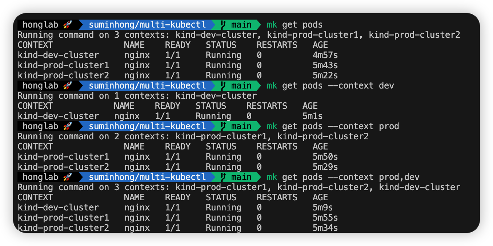

# Multi-Kubectl (mk)

[English](README.md) | [한국어](README_ko.md)


`mk` is a CLI tool that executes `kubectl` commands across multiple Kubernetes contexts and aggregates the results.

## Prerequisites
- `kubectl` must be installed and configured.
```bash
brew install kubectl
```

## Installation

### Homebrew
You can install `mk` using your custom tap:

```bash
brew install suminhong/tap/mk
```

## Usage

```bash
mk [kubectl-args] [--context <filter>]
```

### Examples

Run `get pods` on all contexts:
```bash
mk get pods -n devops
```

Run on contexts containing "prod":
```bash
mk get pods --context prod
```

Run on contexts containing "prod" OR "stage":
```bash
mk get pods --context prod,stage
```

### Context Groups
You can define groups of contexts in `~/.kube/mk_config`:

```yaml
- name: dev
  contexts: dev-cluster, alpha-cluster
- name: aws
  contexts: dev-eks, prod-eks
```

Run on a group:

```bash
mk get pods -g dev
```

Run on multiple groups:
```bash
mk get pods -g dev,aws
```

> [!NOTE]
> `--context` and `-g` cannot be used together. If both are specified, `-g` takes precedence.



## Release Process

Releases are automated using GitHub Actions and Goreleaser. Simply push to the `main` branch to trigger a new release.
